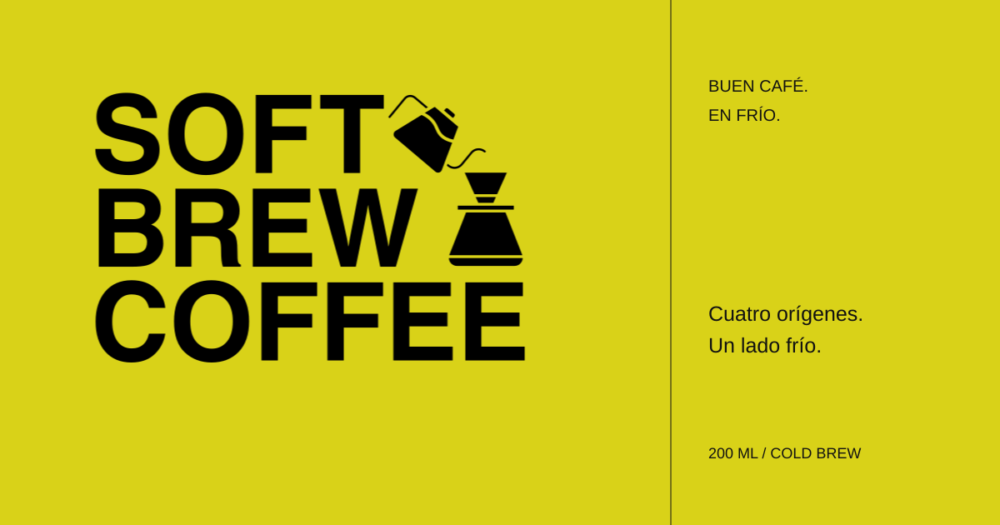
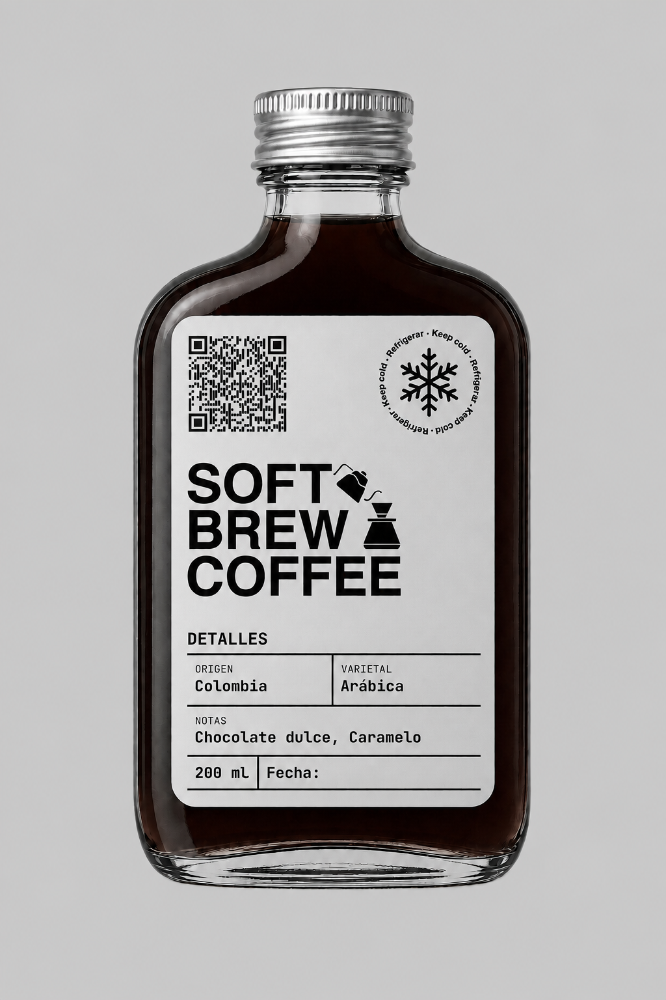
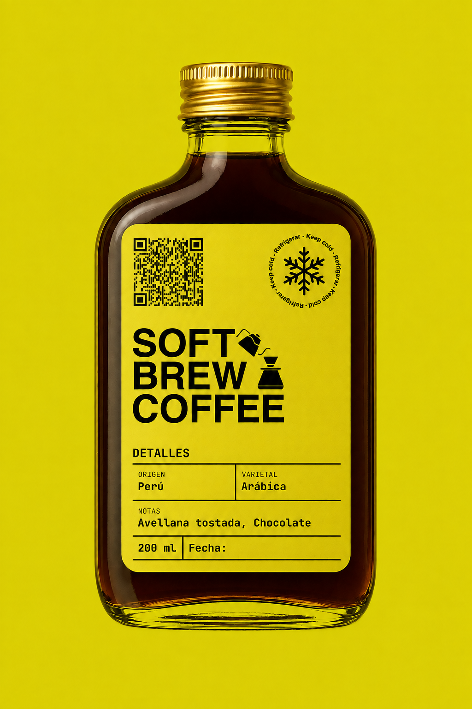
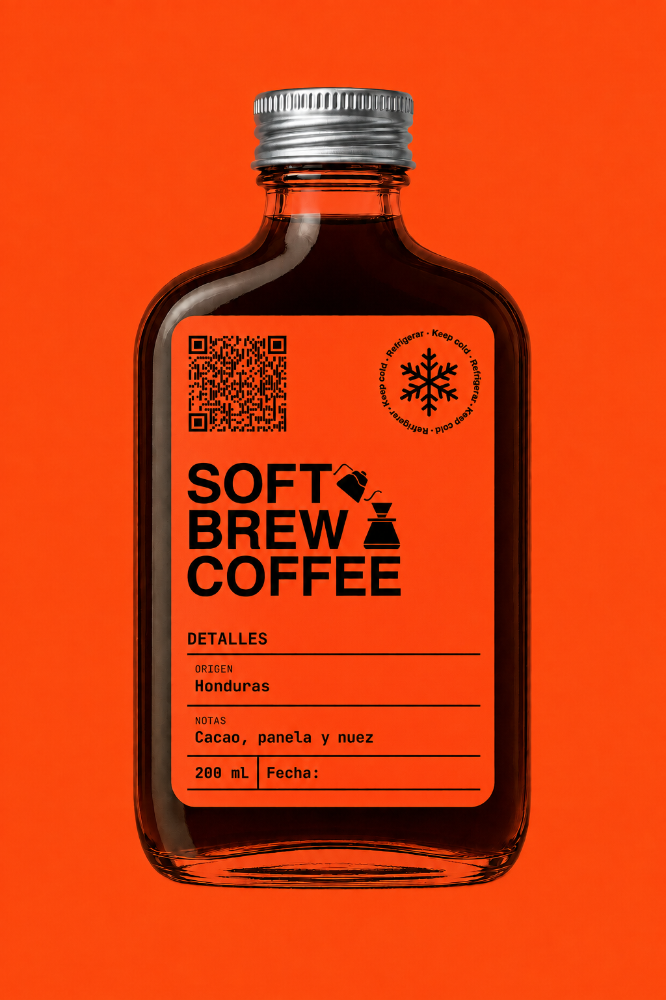
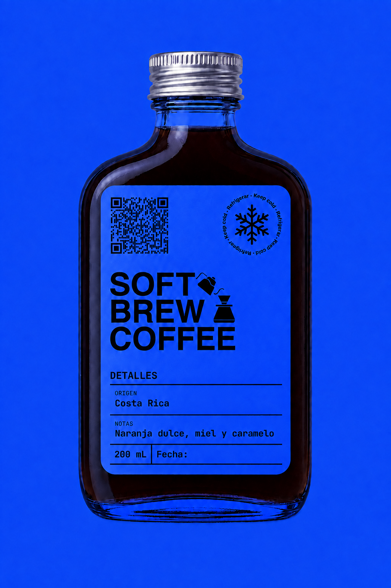
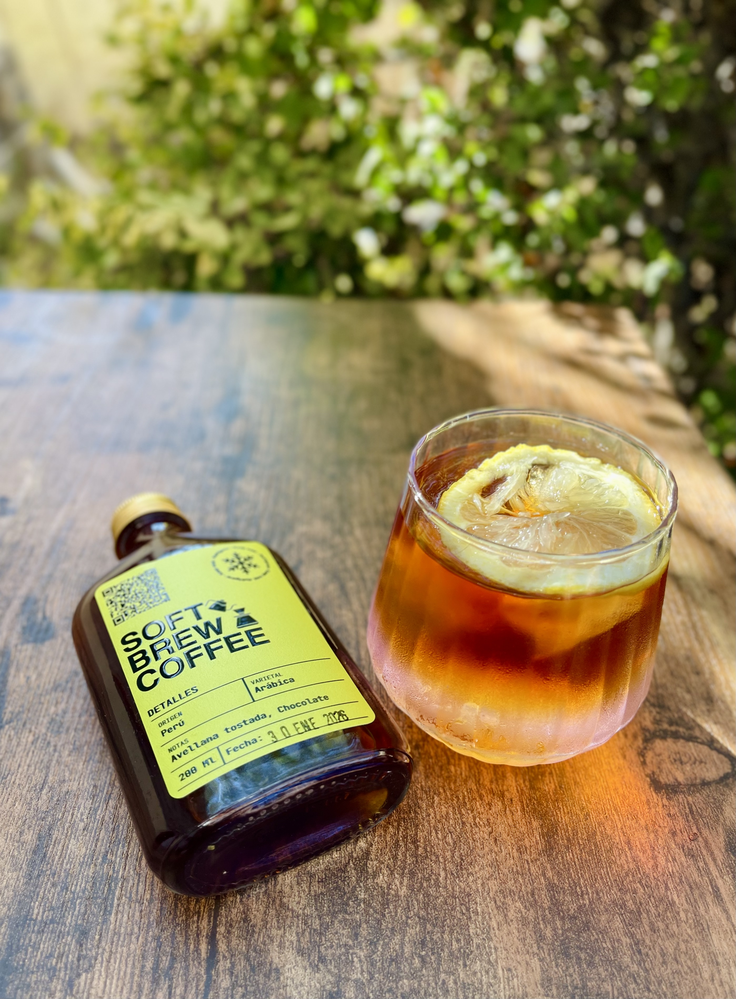
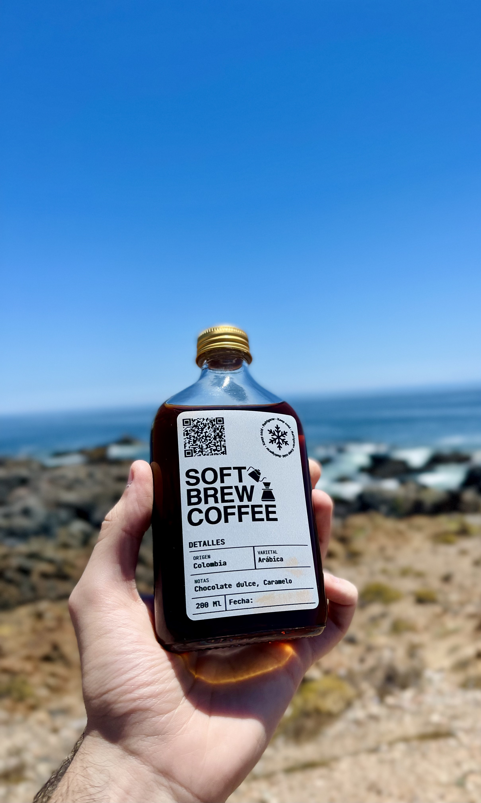

<div align="center">

# Soft Brew Coffee

Una landing editorial para una bebida de café de especialidad: cuatro orígenes, una misma forma de disfrutar el lado frío del café.

[](https://github.com/Glitzypanic/soft-brew-coffee/actions/workflows/verify.yml)


[**Visitar la web ↗**](https://soft-brew-coffee.vercel.app) · [Diseño y brief](PROJECT-BRIEF.md) · [Verificación](docs/RELEASE-REVIEW.md)



</div>

## La colección

<div align="center">




</div>

| Origen | Notas | Infusión | Identidad |
| --- | --- | --- | --- |
| Colombia | Chocolate dulce, caramelo | 24 h | Gris · plata |
| Perú | Avellana tostada, chocolate | 16 h | Amarillo · oro |
| Honduras | Cacao, panela, nuez | 26 h | Naranja · plata |
| Costa Rica | Naranja dulce, miel, caramelo | 24 h | Azul · plata |

## Diseño

- Identidad tipográfica protagonista y retícula editorial con líneas finas.
- Inter Variable y JetBrains Mono servidas localmente.
- Logo original, V60 como separador y vaso de cold brew en el cierre.
- Composición responsive, imágenes WebP con tamaños adaptados y carga diferida.
- Navegación por anclas, acceso por teclado y respeto a movimiento reducido.
- Fotografías originales junto al mar y en una pausa con hielo.

 

## Tecnología

**Astro 7 · TypeScript · CSS a medida · Fontsource · Playwright · axe-core**

## Desarrollo local

Requisitos: **Node ≥22.12** y **npm ≥9.6.5**.

```bash
npm ci
npm run dev
```

Abrir `http://127.0.0.1:4322`.

| Comando | Función |
| --- | --- |
| `npm run dev` | Servidor de desarrollo |
| `npm run build` | Genera el sitio estático en `dist/` |
| `npm run preview` | Vista previa local de producción |
| `npm run check` | Tipos y diagnósticos de Astro |
| `npm test` | Compila y ejecuta las pruebas de navegador |
| `npm run verify` | Diagnósticos y recorrido completo de pruebas |
| `npm run format` | Formatea fuentes y pruebas |

## Calidad y pruebas

```bash
npx playwright install chromium
npm run verify
```

## Recursos y derechos

Este repositorio es público para mostrar y mantener el proyecto. No se concede una licencia general de reutilización del código, marca, fotografías o mockups. Solicitar autorización antes de reutilizarlos. Las fuentes conservan sus licencias en [`public/licenses/`](public/licenses/).
